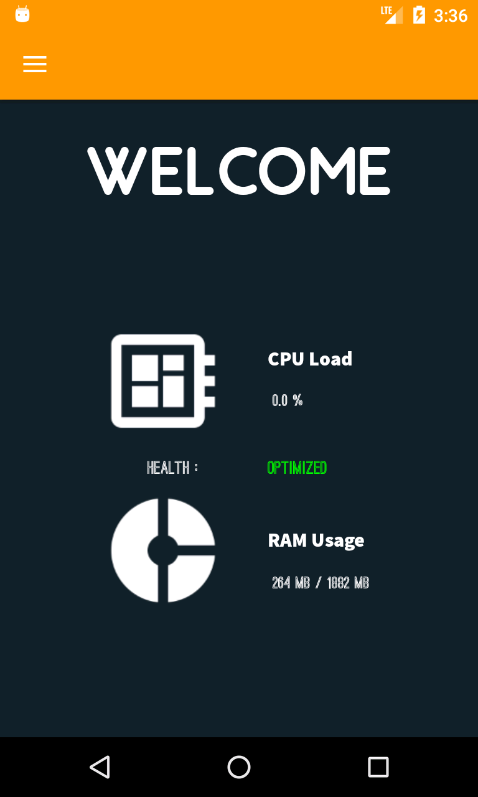
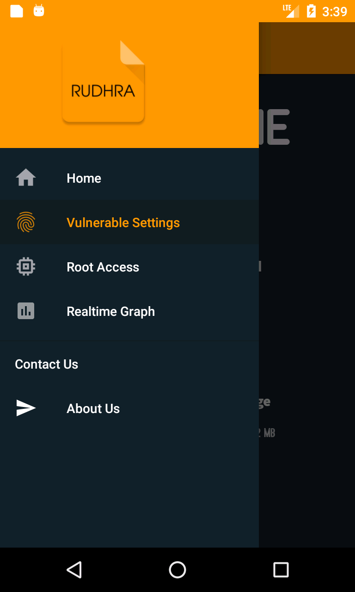
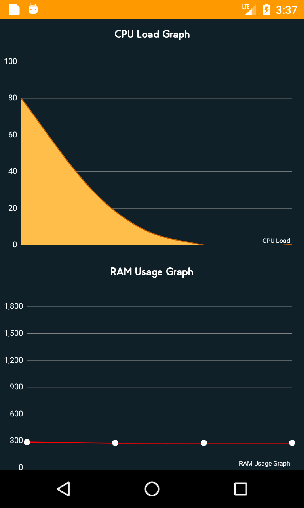
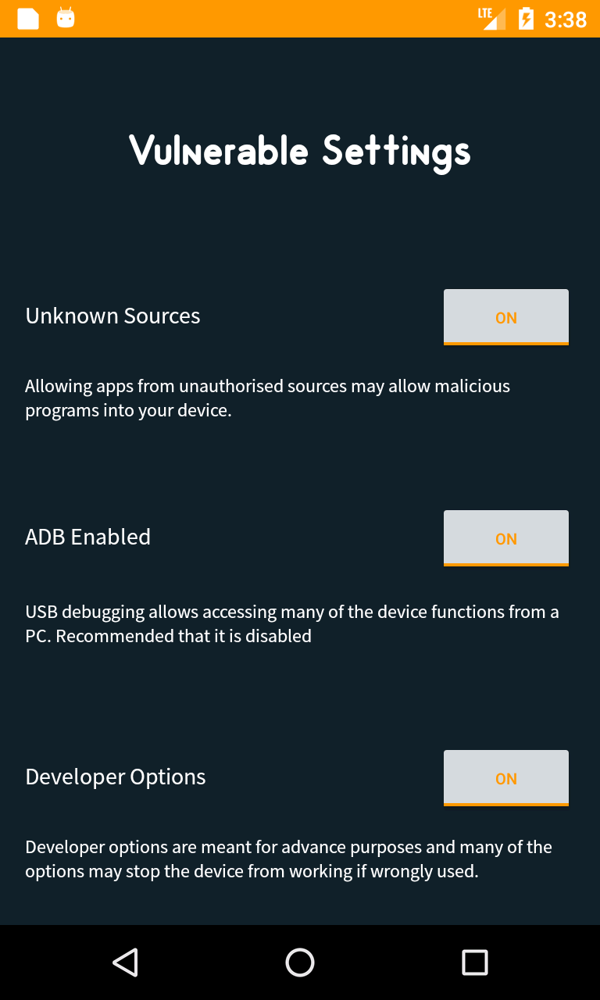
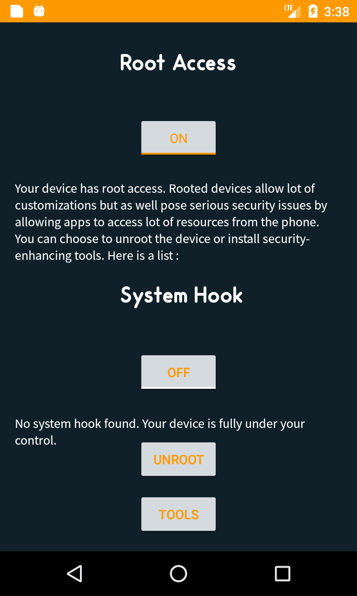

# Rudhra

Android has grown out to be the biggest mobile platform in the world. All the advancements have tailed the rise of malwares affecting the devices running on Android. Every year the number is increasing at an alarming rate. There is an immediate need to tackle this situation. Rudhra is one such ongoing open source project aimed at protecting Android devices in the hands of laymen. The application tells the user about the vulnerable configurations in his device (like, settings) and explains to him why it could prove to be dangerous, gives inforamtion about the overall health of the device, checks for root access etc.

As of now, Rudhra can:

 * Read CPU and RAM usage and represent it on a graph.
 * Check for the existance of root access in a device. 
 * Check if there is a system hook.
 * Check for vulnerable settings.

## Screenshots

